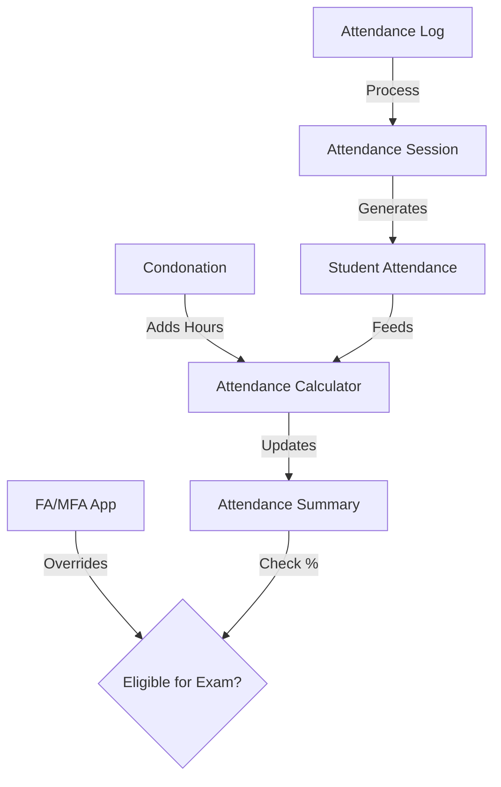

# Deep Dive: Student Attendance System

This document provides a comprehensive technical guide to the core entities (DocTypes) that power the Student Attendance System.

---

## 1. Student Attendance

### Purpose
The **Student Attendance** DocType is the atomic unit of the attendance system. It represents a single student's status (Present/Absent/On Leave) for a specific learning activity (Lecture, Tutorial, or Office Hour).

### Key Features
*   **Unified Model**: Whether it's a Lecture or an Office Hour, all records are stored here.
*   **Duplicate Protection**: Built-in validation prevents multiple records for the same student/session pair.
*   **Audit Trail**: Tracks changes (e.g., from Absent to Present) with reasons, maintaining a history in `Attendance Edit Log`.
*   **Lock Mechanism**: Blocks edits to records older than `attendance_lock_days` (configured in Settings).

### Advantages
*   **Granularity**: Allows precise tracking down to the specific session level.
*   **Auditability**: Instructor changes are logged, ensuring accountability.
*   **Flexibility**: Supports various "Session Types" (Lecture, Lab, Office Hour) with different weighting via `hours_counted`.

### Disadvantages
*   **Volume**: Generates millions of records over time. Requires aggressive archiving or partitioning strategies for large universities.

---

## 2. Attendance Log

### Purpose
The **Attendance Log** captures raw temporal events, primarily from RFID swipes or biometric devices. It acts as the "staging area" for attendance data.

### Key Features
*   **Immutable Raw Data**: Represents the undeniable fact that "Card X swiped at Reader Y at Time Z".
*   **Async Processing**: Logs are inserted rapidly and processed asynchronously to create actual `Student Attendance` records.
*   **Status Tracking**: Tracks processing state (`Unprocessed`, `Processed`, `Error`) to ensure no data is lost.

### Advantages
*   **Decoupling**: Separates hardware events from business logic. If the logic fails (e.g., bug in session matching), the raw log remains safe for re-processing.
*   **Performance**: High-speed ingestion (e.g., thousands of swipes during class changeover) doesn't block the main database.

### Disadvantages
*   **Noise**: Can contain "junk" data (double swipes, passersby) that requires complex filtering logic.
*   **Hardware Dependency**: Relies on the clock synchronization of the reader devices.

---

## 3. Student Attendance Condonation

### Purpose
Allows students to request forgiveness for missed classes due to valid reasons (Medical, Personal). Instead of changing "Absent" to "Present", it adds "Condoned Hours" to the total attended duration.

### Key Features
*   **Workflow Integration**: Triggers an approval process (Student apply -> Chair approve).
*   **Evidence-Based**: Requires attachment of proof documents (e.g., Medical Certificate).
*   **Auto-Calculation**: On approval, automatically recalculates the student's attendance percentage.

### Advantages
*   **Compliance**: Formalizes the "medical leave" process, removing ad-hoc manual adjustments.
*   **Transparency**: Student sees exactly how many hours were condoned and why.

### Disadvantages
*   **Misuse Risk**: Requires strict manual verification of attached documents to prevent fraud.

---

## 4. FA / MFA Application

### Purpose
Manages **First Attempt (FA)** and **Medical First Attempt (MFA)** requests. This is the "Safety Valve" of the system: it overrides strict attendance rules to allow a student to sit for exams despite having low attendance (< 75%).

### Key Features
*   **Logic Override**: An approved FA/MFA acts as a "Golden Ticket". It forces `Eligible for Exam = YES` in the Attendance Summary regardless of the actual percentage.
*   **Strict Validation**:
    *   **University Representation**: Validates that the event dates are within 3 days of the exam.
    *   **Deadlines**: Checks if the application is submitted within the allowed window before/after exams.

### Advantages
*   **Policy Enforcement**: Automates complex university regulations regarding exam eligibility.
*   **Risk Mitigation**: Ensures students with genuine reasons (e.g., representing the university in sports) aren't unfairly penalized.

### Disadvantages
*   **Complexity**: The rules for "eligibility" become complex logic trees (Percentage > 75% OR FA Approved OR MFA Approved).

---

## 5. Attendance Session

### Purpose
The **Attendance Session** is the "Container" for class attendance. It represents a specific instance of a class (e.g., "Math 101 on Monday at 9 AM").

### Key Features
*   **Batch Processing**: One session object manages the creation of attendance records for all enrolled students.
*   **Validation**: Ensures classes are only conducted during valid scheduled times.
*   **Reporting**: Provides a session-by-session breakdown of attendance trends.

### Advantages
*   **Efficiency**: Significant reduction in manual data entry.
*   **Accuracy**: Links attendance directly to the specific topic/instructor for that hour.

### Disadvantages
*   **Scheduling Rigidity**: Requires the `Course Schedule` to be 100% accurate. Last-minute room or time changes must be updated in the system for RFID matching to work.

---

## Summary Diagram

