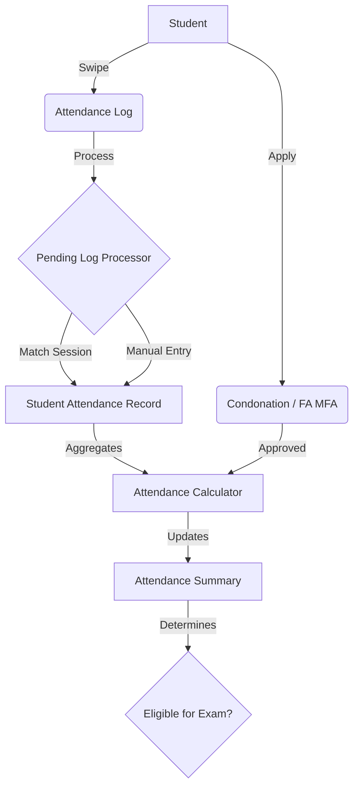

# Comprehensive Attendance System Workflow

This document outlines the end-to-end workflows for the Unified Attendance System, covering Daily Attendance, Condonation, and FA/MFA Applications.

## 1. Daily Attendance Workflow

The system uses a Unified Data Model where all attendance (Lectures, Tutorials, Office Hours) is stored in `Student Attendance`.

### 1.1 RFID Swipe Processing
1.  **Student Swipes**: Student taps RFID card at the classroom or office reader.
2.  **Log Creation**: `Attendance Log` is created (Status: Unprocessed).
3.  **Scheduled Processing**: `process_pending_logs` runs periodically (e.g., every 15 mins).
    *   **Group**: Logs are grouped by Student & Date.
    *   **Session Match**: System looks for an `Attendance Session` (Lecture) or `Office Hours Session` that matches the Swipe Time (with buffer).
    *   **Enrollment Check**: Verifies student is enrolled in the Cohort/Course.
    *   **Validation**: Ensures multiple unique sessions can be attended per day.
4.  **Attendance Record**:
    *   **Lecture**: Creates `Student Attendance` with `session_type="Lecture"`, `hours_counted=1.0`.
    *   **Office Hour**: Creates `Student Attendance` with `session_type="Office Hour"`, `hours_counted=Duration`.
    *   **Status**: Marked as `Present` (or `Absent` if strictly enforcing constraints).

### 1.2 Manual Attendance Workflow
If RFID is not used, Faculty or Admins can mark attendance manually.

#### Option A: Bulk Marking (Student Attendance Tool)
1.  Navigate to **Student Attendance Tool**.
2.  Select **Course**, **Date**, and **Session** (or Time).
3.  The tool fetches the list of students enrolled.
4.  Faculty marks checkboxes for Present students.
5.  **Submit**:
    *   System creates `Student Attendance` records for all selected students.
    *   Status: `Present`.
    *   Session Type: `Lecture` (default) or as configured.

#### Option B: Individual Entry
1.  Navigate to **Student Attendance List**.
2.  Click **Add Student Attendance**.
3.  Select **Student**, **Course**, and **Date**.
4.  Set Status to `Present` or `Absent`.
5.  **Save**.

### 1.3 Calculation Logic
*   **Total Classes (Required)**: Sum of all *Conducted* Lectures (Office Hours do NOT increase the denominator).
*   **Attended Classes**: Sum of (Lecture Hours + Office Hours + Condoned Hours).
*   **Percentage**: `(Attended / Total Required) * 100`
*   **Result**: Office Hours act as a "Bonus" to cover missed lectures.

---

## 2. Attendance Condonation Workflow

Used when a student misses classes due to valid reasons (Medical, Personal) and requests "forgiveness" in the form of added hours.

### 2.1 Workflow Steps
1.  **Application**: Student creates `Student Attendance Condonation` request.
    *   Selects Course and enters `Number of Hours` to claim.
    *   Attaches Proof Document.
2.  **Review**: Programme Chair reviews the request.
3.  **Approval**:
    *   **Approved**: Status changes to `Approved`. Logic automatically adds these hours to the student's *Attended* count for that course.
    *   **Rejected**: Request is closed.

---

## 3. FA / MFA Application Workflow

Used when a student fails to meet the minimum attendance threshold (75%) but has a valid reason (Medical/University Representation) to sit for exams (First Attempt - FA / Medical First Attempt - MFA).

### 3.1 Eligibility Rules
*   **University Representation**:
    *   **Strict Date Validation**: Participation dates must be within **3 days** of the examination date.
    *   System throws an error if dates are outside this window.
*   **Medical**: Requires Medical Certificate.

### 3.2 Approval Workflow
1.  **Apply**: Student creates `FA MFA Application`.
    *   Type: `First Attempt (FA)` or `Medical First Attempt (MFA)`.
    *   Status: `Pending`.
2.  **Review**: Programme Chair reviews dates and proof.
3.  **Disposition**:
    *   **Approve**:
        *   Status -> `Approved`.
        *   System sets `Approver` to current user.
        *   **Effect**: `Attendance Summary` takes this as an unconditional override. `Eligible for Exam` becomes **YES** regardless of actual percentage.
    *   **Reject**:
        *   Status -> `Rejected`.
        *   **Rejection Reason**: Mandatory field.
4.  **Submit**: Approved document is submitted to lock changes.

---

## 4. System Roles & Permissions

| Role | Actions |
| :--- | :--- |
| **Student** | **Create**: Condonation, FA/MFA Apps. <br> **Read**: Own Attendance, Logs. |
| **Faculty** | **Read**: Course Attendance. <br> **Define**: Office Hours. |
| **Programme Chair** | **Approve/Reject**: Condonation, FA/MFA. <br> **Edit**: Manual Attendance. |
| **System Manager** | **Configure**: Settings, RFID Modes, Automation. |

---

## 5. Verification Guide / How-To Test

Follow these steps to verify the system manually or via scripts.

### 5.1 Verifying RFID Attendance
1.  **Setup**: ensure a Student is enrolled in a Course Offering.
2.  **Create Session**: Create an `Attendance Session` for the course (Type: Lecture) for Today.
3.  **Simulate Swipe**: Create an `Attendance Log` entry for that student with a timestamp matching the session.
4.  **Run Process**: Execute `bench execute slcm.slcm.doctype.attendance_log.process_attendance_logs.process_pending_logs`.
5.  **Verify**: Check `Student Attendance` list. A record should exist with Status `Present` and Type `Lecture`.

### 5.2 Verifying Manual Attendance
1.  Go to **Student Attendance Tool**.
2.  Select a Course and Date.
3.  Mark a student as Present and Save.
4.  Verify a `Student Attendance` record is created.

### 5.3 Verifying Office Hours (Bonus)
#### Option A: RFID / Log Process
1.  **Create Session**: Create an `Attendance Session` with Type `Office Hour`.
2.  **Swipe**: Create two `Attendance Log` entries (In and Out) spanning e.g., 1 hour.
3.  **Process**: Execute `bench execute slcm.slcm.doctype.attendance_log.process_attendance_logs.process_pending_logs`.
4.  **Verify**: Check `Student Attendance`. Logic should capture exact duration (e.g., 1.0) in `Hours Counted`.

#### Option B: Manual Entry
1.  Go to **Student Attendance List**.
2.  Click **Add Student Attendance**.
3.  **Fields**:
    *   **Student**: Select Student.
    *   **Session Type**: Select `Office Hour`.
    *   **Status**: `Present`.
    *   **Hours Counted**: Enter duration (e.g., `1.5`).
4.  **Save**.
5.  **Verify**: Check `Attendance Summary` to see if Attended hours increased.

### 5.4 Verifying Calculation & Condonation
1.  **Check Summary**: Go to `Attendance Summary` for the student/course.
    *   Check `Total Classes` (Should match number of Lectures).
    *   Check `Attended Classes` (Should be sum of Lectures + Office Hours).
2.  **Apply Condonation**: Create a `Student Attendance Condonation` for 2 hours and Approve it.
3.  **Verify**: Note that `Attended Classes` increases by 2.

### 5.5 Verifying FA/MFA Override
1.  **Check Status**: Ensure student has low attendance (<75%) -> `Eligible for Exam` should be **No**.
2.  **Create App**: Create an `FA MFA Application`, set Status to `Approved`.
3.  **Verify**: Go back to `Attendance Summary`. `Eligible for Exam` should now be **Yes**.

---

## 6. Process Diagrams

### 6.1 Data Flow Overview


### 6.2 Daily Processing Logic
```mermaid
flowchart TD
    Start[New Log Found] --> CheckIn{Is Check-In?}
    CheckIn -- Yes --> Wait[Wait for Check-Out or Timeout]
    CheckIn -- No (Out Only) --> Ignore[Ignore / Log Error]
    
    Wait --> Pair{Pair Found?}
    Pair -- Yes --> CalcDur[Calculate Duration]
    Pair -- No --> Timeout[Assume Default Duration]
    
    CalcDur --> Match{Match Session?}
    Match -- Lecture --> MarkLec[Mark 'Lecture' (1 hr)]
    Match -- Office Hour --> MarkOH[Mark 'Office Hour' (Actual Duration)]
    Match -- None --> Unmapped[Mark Unmapped / Extra]
    
    MarkLec --> Save[Save Student Attendance]
    MarkOH --> Save
    Unmapped --> Save
```

### 6.3 Eligibility Calculation Logic
```mermaid
flowchart TD
    Calc[Start Calculation] --> FetchSes[Fetch Total Conducated Sessions]
    FetchSes --> FetchAtt[Fetch Student Attendance]
    FetchAtt --> Sum[Sum: Lectures + Office Hours + Condonation]
    
    Sum --> Pct{Calculate %}
    Pct --> CheckMin{>= 75%?}
    
    CheckMin -- Yes --> Eligible[Eligible: YES]
    CheckMin -- No --> CheckFA{Has FA/MFA App?}
    
    CheckFA -- Yes (Approved) --> Override[Eligible: YES (Override)]
    CheckFA -- No --> NotEl[Eligible: NO]
```
