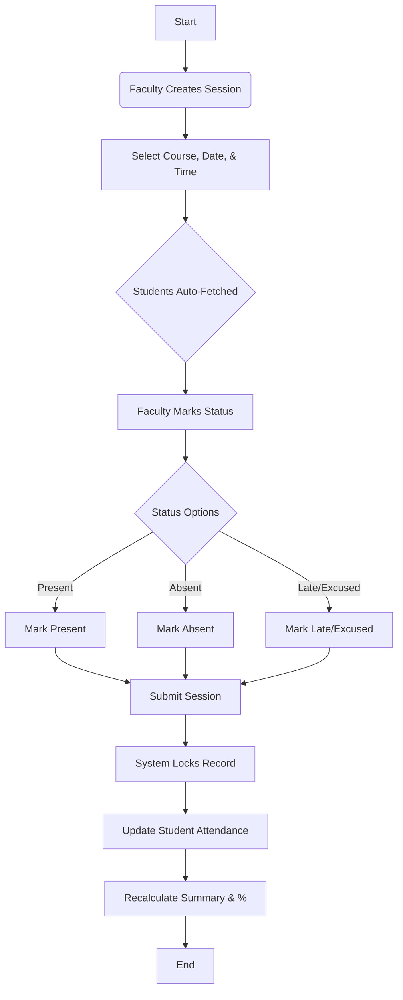
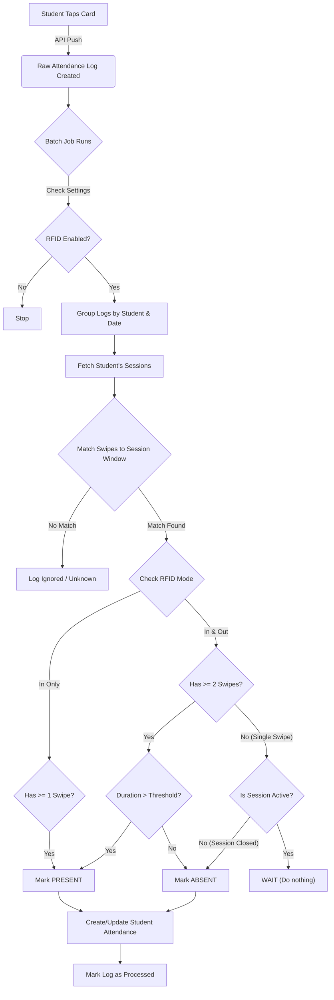
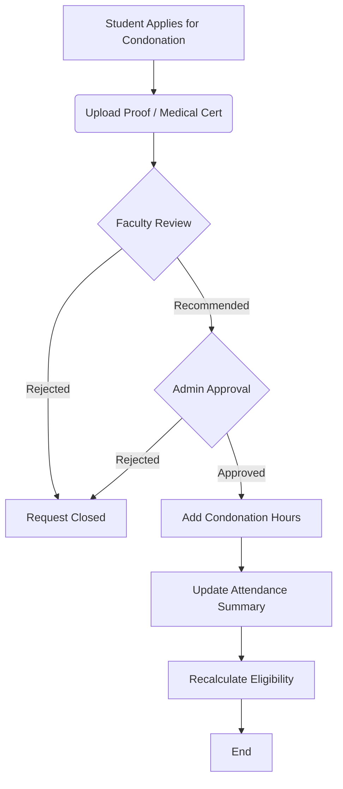

# Comprehensive Attendance Workflows

This document details the end-to-end workflows for the Attendance Module.

## 🟢 Workflow 1: Manual Attendance (Standard System)
This is the **System of Record**. Even if RFID is used, this workflow remains available for corrections and fallbacks.

### Phase 1: Setup (One-Time)
1.  **Academic Configuration**: Ensure `Academic Year`, `Program`, `Term`, and `Courses` are created.
2.  **Timetabling**: Create `Course Schedules` for the term.
3.  **Settings**: Go to `Attendance Settings` and ensure:
    -   `Enable RFID` is **Unchecked** (unless ready).
    -   `Attendance Lock Days` is set (e.g., 7 days).

### Phase 2: Daily Operations (Faculty/Admin)
1.  **Create Session**:
    -   Faculty creates a new `Attendance Session`.
    -   Selects: `Course Offering`, `Instructor`, `Date`, and `Time`.
    -   *System*: Auto-fetches the list of enrolled students.
2.  **Mark Attendance**:
    -   Faculty marks status: `Present`, `Absent`, `Late`, or `Excused`.
    -   Default status is usually `Present` (configurable).
3.  **Submit**:
    -   Faculty saves and submits the session.
    -   *System*: Locks the record against further edits (based on Lock Days).

### Phase 3: System Calculation (Automated)
1.  **Trigger**: Immediately upon submission.
2.  **Action**: 
    -   Updates `Student Attendance` records.
    -   Recalculates `Attendance Summary` for each student.
    -   Updates `Attendance Percentage` and `Eligibility Status`.

### 📊 Manual Logic Flow Diagram

---

## 🟠 Workflow 2: RFID Attendance (Automated Layer)
RFID is a **data ingestion source**. It feeds into the same System of Record.

### Phase 1: Infrastructure Setup (Admin)
1.  **Device Registration**:
    -   Create `RFID Device` records for every physical reader.
    -   Note the `Device ID` (e.g., `GATE-01`, `CLASS-101`).
2.  **Tag Assignment**: 
    -   Go to `Student Master`.
    -   Assign the physical card's UID to the `RFID UID` field.
3.  **Activation**:
    -   Go to `Attendance Settings`.
    -   Check **Enable RFID Attendance**.
    -   Save.

### Phase 2: The Physical Action (Student)
1.  **Tap**: Student Taps card on Reader.
2.  **Hardware Push**: 
    -   Reader sends POST request to `/api/attendance/rfid/log`.
    -   Payload: `{ rfid_uid, device_id, timestamp }`.
3.  **Ingestion**:
    -   System validates `Device ID`.
    -   Creates a **Raw** `Attendance Log`.
    -   Status set to `Processed: 0`.

### 📊 RFID Logic Flow Diagram

### Phase 3: Processing & Reconciliation (System Job)
*This happens automatically in the background.*

1.  **Check 1: Verification**:
    -   Existing `Attendance Log` records are fetched.
    -   System checks if **Enable RFID** is True. If False, **STOP**.
2.  **Check 2: Grouping**:
    -   Logs are grouped by `Student` + `Date`.
3.  **Check 3: Session Matching**:
    -   Fetch `Attendance Sessions` for the student for that day.
    -   Match swipes to sessions based on time coordinates ( Start Time +/- Buffer).
    -   **Mode Check**: Apply configured logic:
        -   **In Only**: Single swipe checks "In Time" -> Marks `Present`.
        -   **In & Out**: 
            -   Checks for **Two Swipes** (In + Out).
            -   If Session is *Active* and only 1 swipe exists -> **Wait** (Leave Unprocessed).
            -   If Session is *Closed* and only 1 swipe exists -> **Absent**.
            -   If Two swipes exist -> Calculate Duration -> Marks `Present`.
4.  **Record Creation**:
    -   creates a `Student Attendance` record **Per Session**.
    -   Sets Source = `RFID`.
    -   Links the raw `Attendance Logs`.
5.  **Finalization**:
    -   Marks `Attendance Log` as `Processed: 1`.
    -   Triggers standard **Attendance Calculation** (same as Manual workflow).

---

## 🔵 Workflow 3: Condonation (Exception Handling)
Handling medical or official leaves.

1.  **Application**: Student applies for `Attendance Condonation`.
2.  **Review**: Faculty recommmends -> Admin Approves.
3.  **Effect**: 
    -   Approved days/hours are added to the "Attended" count in `Attendance Summary`.
    -   Percentage increases.
    -   Students may move from "Detained" to "Eligible".

### 📊 Condonation Logic Flow Diagram

