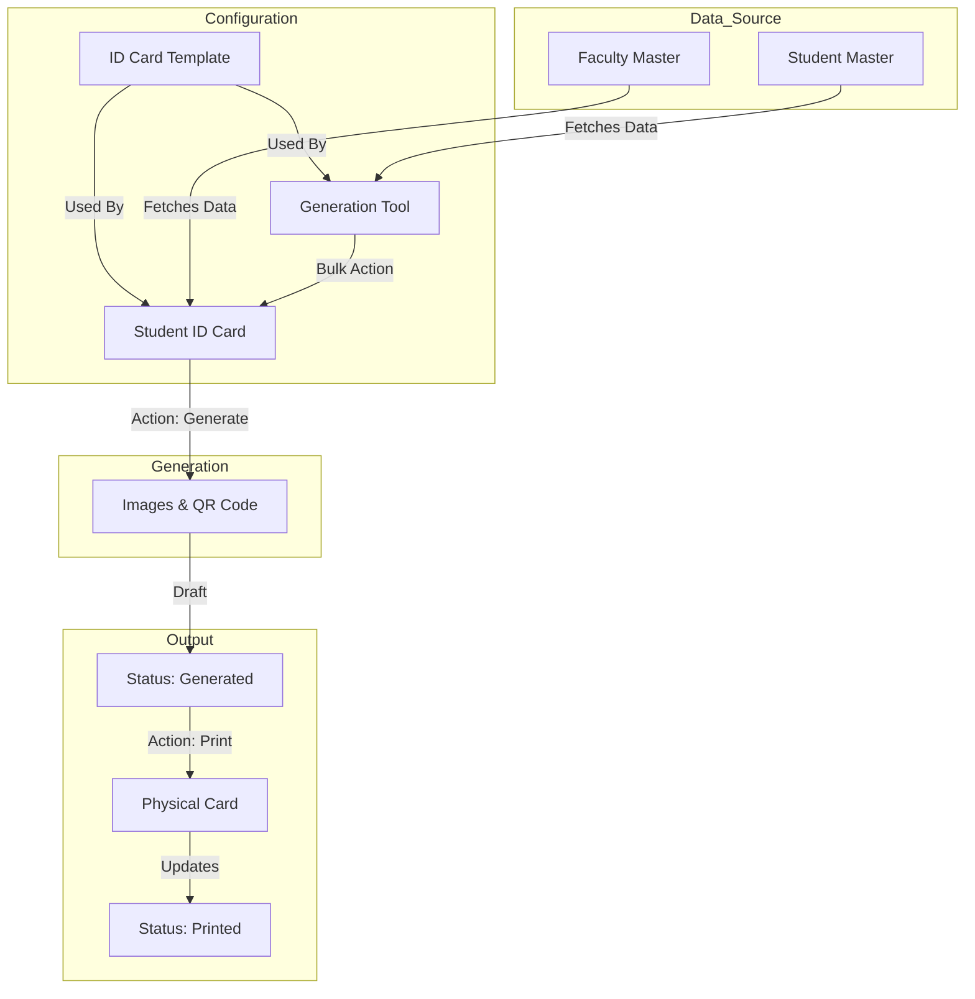

# ID Card Workflow

This document outlines the workflow for **ID Card Management** in the SLCM system. It covers the end-to-end process from designing templates to generating, verifying, and printing ID cards for Students, Faculty, and Staff.

## Overview

The ID Card module allows for both individual and bulk generation of identity cards. It utilizes configurable templates and integrates with the Student/Faculty master data to populate details automatically.

### Key Features
*   **Dynamic Templates**: Customizable layouts for different roles (e.g., Student vs. Faculty).
*   **Bulk Generation**: Tool to generate cards for entire batches or departments.
*   **QR Code Verification**: Automatic generation of QR codes for authenticity verification.
*   **Print Tracking**: Logs print history to prevent unauthorized duplication.

---

## Roles and Responsibilities

| Role | Responsibilities |
| :--- | :--- |
| **System Manager / Admin** | Configuring ID Card Templates and naming series. |
| **Registrar Office** | Verifying student data (Photos, Details) and performing bulk generation. |
| **IT / Security Team** | Printing physical cards and verifying entries using QR codes. |

---

## 1. Configuration & Setup

Before generating cards, the necessary templates and data must be in place.

### 1.1 ID Card Templates (Template Creation)
*   **DocType**: `ID Card Template`
*   **Purpose**: Defines the layout, background images, and field mapping for the ID cards.
*   **Template Creation Modes**: The system supports four distinct modes for creating templates, catering to different customization needs:

    1.  **Field Mapping** (Standard Mode):
        *   **Best for**: Standard ID cards with fixed layouts.
        *   **Process**: Upload front/back background images and manually define X/Y coordinates for fields like Name, ID, Photo, etc.

    2.  **Jinja Template** (Advanced Mode):
        *   **Best for**: Developers needing complete control over HTML/CSS.
        *   **Process**: Write raw HTML with Jinja2 placeholders (e.g., `{{ doc.student_name }}`) to render the card. Ignores standard field mappings.

    3.  **Drag and Drop** (Visual Editor):
        *   **Best for**: Quick visual design without coding.
        *   **Process**: Use an interactive canvas to drag elements (Text, Image, QR Code) onto the card area and resize/position them visually.

    4.  **Canva Integration**:
        *   **Best for**: High-fidelity graphic design.
        *   **Process**: Launch Canva directly from the system, design the card using Canva's tools, and export the design back into the template.

*   **Setup Steps**:
    1.  Create a new `ID Card Template`.
    2.  Select the **Template Creation Mode** (e.g., Field Mapping).
    3.  Upload **Institute Details** (Logo, Signature, Watermark) if applicable.
    4.  Configure the design based on the selected mode.

### 1.2 Data Preparation
*   Ensure that `Student Master` or `Faculty` records are up-to-date.
*   **Critical**: A valid **Passport Size Photo** must be attached to the master record.

---

## 2. Generation Process

Cards can be generated in two ways: Individual Request or Bulk Processing.

### 2.1 Individual Generation (Manual)
Used for new joiners or replacements.

1.  **Navigate to**: `Student ID Card` list.
2.  **Create New**:
    *   Select **Card Type** (Student, Faculty, Driver, Visitor, etc.).
    *   Select the **Source Record** (e.g., Student ID). System fetches details (Name, Dept, Photo) automatically.
    *   Select **ID Card Template**.
3.  **Generate**:
    *   Click the **"Generate Card"** button.
    *   The system creates the **Front Image**, **Back Image**, and **QR Code**.
    *   Status updates to `Generated`.

### 2.2 Bulk Generation (Tool)
Used for new academic batches.

1.  **Navigate to**: `ID Card Generation Tool`.
2.  **Set Filters**: Select `Academic Year`, `Department`, `Program`, and `Batch`.
3.  **Select Template**: Choose the appropriate `ID Card Template`.
4.  **Fetch Data**: Click **"Get Students"** to populate the list.
5.  **Preview**: (Optional) Generate a preview for the first student to verify the layout.
6.  **Process**:
    *   Click **"Generate Cards"**. This runs a background job to create `Student ID Card` records for all selected students.
    *   Once done, options to **"Download ZIP"** (containing all images) or **"Download Print Layout"** become available.

---

## 3. Printing & Verification

### 3.1 Verification
*   **QR Code**: Every generated card includes a unique QR code.
*   **Scanning**: Scanning the code directs security personnel to a verification URL (`verification_url`), displaying the live status and details of the cardholder from the system.

### 3.2 Printing
1.  **Print Request**:
    *   Open the `Student ID Card` record.
    *   Click **"Print Card"**.
    *   A print-friendly window opens with both Front and Back views.
2.  **Logging**:
    *   The system increments the `print_count` field automatically.
    *   Status updates to `Printed`.

---

## Workflow Diagram

## Update Status Mechanism

The `Card Status` field tracks the lifecycle:

*   **Draft**: Record created but images not yet generated.
*   **Generated**: Images and QR code successfully created.
*   **Printed**: Card has been sent to the printer.
*   **Expired**: Automatically marked when `Expiry Date` is passed.
*   **Cancelled**: Manually marked if the card is lost or the student leaves.
