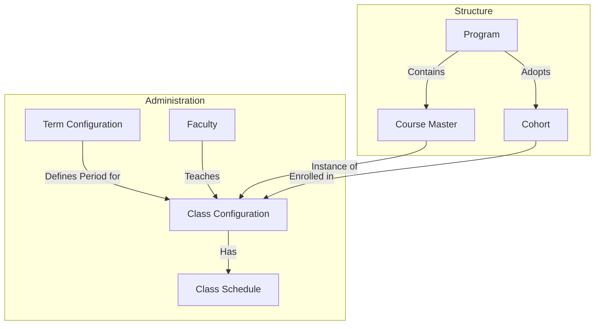

# Programme Management Workflow

This document outlines the comprehensive workflow for **Programme Management** in the SLCM system. It covers the hierarchy from defining academic programs to managing daily class schedules.

## Overview

The Programme Management module is organized into two main sections:
1.  **Course Structure**: Defining the static and high-level academic offerings (Programs, Courses).
2.  **Course Administration**: Managing the dynamic execution of these offerings (Terms, Classes, Schedules).

---

## 1. Course Structure

This section handles the definition of what the institution offers.

### 1.1 Program & Cohort
*   **Program**: The overarching academic degree (e.g., B.Tech CS).
*   **Cohort**: A specific student batch for a program (e.g., B.Tech CS 2024-2028).

*(See previous "Program Workflow" and "Cohort Workflow" sections for details on these).*

### 1.2 Course Management
*   **Course Master**: Defines individual subjects (e.g., "Introduction to Programming", "Data Structures").
    *   Linked to Departments and Programs.
    *   Defines Credits and Evaluation metrics.
*   **Course Management Tool**: A dedicated interface to set up and visualize the curriculum structure for a Program.
    *   Used to map Courses to specific Semesters/Years within a Program.
    *   Allows defining "Course Types" (Core, Elective) and "Enrollment Types".

---

## 2. Course Administration

This section handles the "when" and "how" of academic delivery.

### 2.1 Term Administration
*   **Term Configuration**: Defines the specific time periods for academic activities (e.g., "Fall Semester 2025").
    *   **Fields**: Term Name, Academic Year, Start Date, End Date, System (Semester/Trimester).
    *   **Mapping**: Maps to specific Batches and Programmes active during this term.
*   **Term Administration Tool**: A dashboard for administrators to manage the current term's activities, including class creation and scheduling.

### 2.2 Class Configuration
A **Class** is the specific offering of a **Course** during a **Term**.
*   **Workflow**:
    1.  **Create Class**: Select the `Course`, `Term`, and `Faculty` (Instructor).
    2.  **Type**: Define if it is Theory, Practical, Lab, or Tutorial.
    3.  **Seat Limit**: Set the maximum capacity.
    4.  **Enroll Students**: Link `Student Groups` or individual students (`Class Student` table).

### 2.3 Schedule Management
Scheduling handles the actual timetable for classes and events.

*   **Class Schedule**: Defines the weekly timetable for a Class.
    *   **Fields**: `Class Configuration`, `Instructor`, `Room`, `Day`, `Start Time`, `End Time`.
    *   **Repetition**: Can be set to repeat Daily, Weekly, etc., until a specific date.
    *   **Visualization**: Viewable in a Calendar format to check for conflicts.
*   **Event Schedule**: Used for non-academic events (Seminars, Workshops) that also require room and time allocation.

---

## Workflow Diagram

## Update Status Mechanism

*   **Program/Cohort**: Status fields (`Active`, `Inactive`, `Completed`).
*   **Term**: Defined by Date Ranges. Terms automatically become "past" when the end date is crossed, though the record remains for history.
*   **Class**: Managed via the `Term Administration` tool. Classes are typically created for an active term and archived once the term ends.
