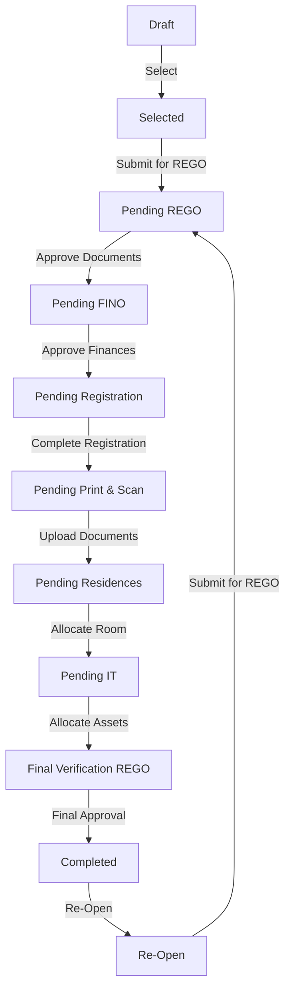

# Student Registration Workflow

This document outlines the workflow for the **Student Registration** process in the SLCM system. It covers the lifecycle of a student implementation, from initial selection to final completion, including role-based responsibilities and status update mechanisms.

## Overview

The registration process is managed through the **Student Master** doctype. The workflow is designed to move a student application through various departments (Registration, Finance, Documentation, Residence, IT) for verification and approval.

### Workflow Metadata
- **Workflow Name**: Student Registration Workflow
- **Document Type**: `Student Master`
- **State Field**: `registration_status`

---

## Roles and Responsibilities

The following roles are involved in the registration process:

| Role | Responsibilities |
| :--- | :--- |
| **System Manager** | Overall administration, initial selection, re-opening applications. |
| **Student** | Submitting the application for registration. |
| **Registration User** | Initial submission (on behalf of student if needed). |
| **REGO Officer** | Verification of initial documents and details. |
| **FINO Officer** | Verification of financial status and fee payments. |
| **Registration Officer** | Completing the core registration and final approval. |
| **Documentation Officer** | Verifying uploaded documents and printing/scanning tasks. |
| **Residence / Hostel Admin** | Allocation of hostel rooms and assets. |
| **IT Admin** | Allocation of IT assets (laptop, email, etc.) and system access. |

---

## Workflow States

The `Student Master` record moves through the following states:

1.  **Draft**: Initial state when the record is created.
2.  **Selected**: The student has been selected for the process.
3.  **Pending REGO**: Awaiting review by the Registration Office.
4.  **Pending FINO**: Awaiting review by the Finance Office.
5.  **Pending Registration**: Awaiting core registration completion.
6.  **Pending Print & Scan**: Awaiting document printing and scanning.
7.  **Pending Residences**: Awaiting hostel/residence allocation.
8.  **Pending IT**: Awaiting IT asset allocation.
9.  **Final Verification REGO**: Final review by the Registration Office.
10. **Completed**: The registration process is fully complete.
11. **Re-Open**: State for applications that need to be re-processed.

---

## Workflow Transitions

The following table details the allowed transitions between states, the action required, and the role authorized to perform it.

| Current State | Action | Next State | Allowed Roles |
| :--- | :--- | :--- | :--- |
| **Draft** | Select | **Selected** | System Manager |
| **Selected** | Submit for REGO | **Pending REGO** | Student, Registration User |
| **Pending REGO** | Approve Documents | **Pending FINO** | REGO Officer |
| **Pending FINO** | Approve Finances | **Pending Registration** | FINO Officer |
| **Pending Registration** | Complete Registration | **Pending Print & Scan** | Registration Officer |
| **Pending Print & Scan** | Upload Documents | **Pending Residences** | Documentation Officer |
| **Pending Residences** | Allocate Room | **Pending IT** | Residence / Hostel Admin |
| **Pending IT** | Allocate Assets | **Final Verification REGO** | IT Admin |
| **Final Verification REGO** | Final Approval | **Completed** | Registration Officer |
| **Completed** | Re-Open | **Re-Open** | System Manager |
| **Re-Open** | Submit for REGO | **Pending REGO** | System Manager |

---

## Update Status Mechanism

The status of a student registration is updated through a dedicated **"Update Status"** button on the Student Master form.

### How to Update Status

1.  **Open Student Master**: Navigate to the `Student Master` record for the student.
2.  **Click Workflow Action**: If you have the appropriate role, you will see a workflow action button (e.g., "Approve Documents", "Approve Finances") in the top right corner.
3.  **Status Button**: Alternatively, there is a generic **"Status"** button available for users with permission.
    *   Clicking this opens a **"Update Registration Status"** dialog.
    *   The dialog shows the **Current Status**.
    *   Select the **New Status** from the dropdown list (only allowed transitions are shown).
    *   **Remarks are Mandatory**: You must enter remarks to explain the reason for the status change.
    *   Click **"Update Status"** to confirm.

### Validation & Automation

-   **Remarks**: The system enforces that remarks are provided for every audit trail.
-   **Re-Open Warning**: If moving to "Re-Open", the system will ask for explicit confirmation as this may require re-verification of all details.
-   **Enrollment Check**: The system also includes a validation check (`validate_new_enrollment`) to ensure a student can only be enrolled (create a `Student Enrollment` record) if they satisfy specific criteria, often linked to their registration status.

